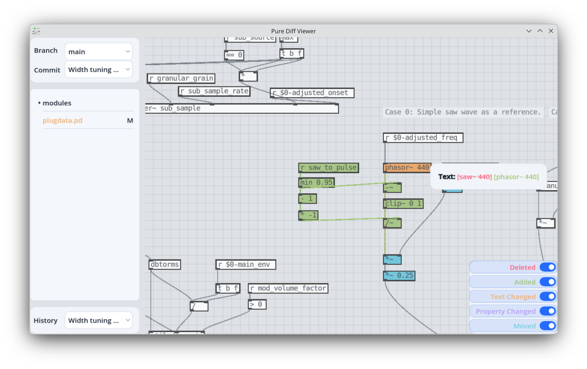

# Pure Diff Viewer: A Visual Git Diff Tool for Pure Data Patches

This program aims at facilitating the version control of [Pure Data](https://puredata.info/) (Pd), a visual programming language for computer music. When organizing Pd patches in a [Git](https://git-scm.com/) repository, the differences between commits are shown in plain text. The text is hardly human-readable and makes it difficult to track the changes of a patch and maintain it in the long term.

This program attempts to solve this problem by visualizing the differences and rendering them in the Pd node graph. It has the following features:

- Graphical browser of a Git repository of Pure Data (Pd) patches
  - Switches between multiple branches/commits to trace the changes of a patch
  - Highlights and categorizes patch changes in a semantic way with visual marks
- Integration with `git difftool`
  - Supports file/directory comparisons via `git` commands



## Usage

### Git Repository Browser

Execute this program directly and select a directory which is a Git repository. The program will show all branches, commits and the file tree of the selected repository. By clicking a file name of a Pd patch, the program will render the graphical topology of the patch and highlights its changes compared with the parent commit.

### Git Diff Tool

To integrate this program with `git difftool`, the path of this program needs to be added in the Git configuration file. The first method is to use the following command,

```bash
# Linux / macOS
git config --global difftool.purediff.cmd "/YOUR/PATH/TO/purediff \$LOCAL \$REMOTE"
```
```powershell
# Windows Powershell
git config --global difftool.purediff.cmd "/YOUR/PATH/TO/purediff `$LOCAL `$REMOTE"
```
Another method is to modify the configuration file (`~/.gitconfig`) manually by adding the following section:

```
[difftool "purediff"]
        cmd = /YOUR/PATH/TO/purediff $LOCAL $REMOTE
```

(Please replace `/YOUR/PATH/TO/purediff` to the actual full path of this program in your system.)

Once configured, this program can be invoked by executing the following command inside a Git repository:

```
git difftool -d --tool purediff
```

The option `-d, --dir-diff` is recommended to view the changes of multiple files in the same session. Please refer to the official manuals of [git-difftool](https://git-scm.com/docs/git-difftool) and [git-diff](https://git-scm.com/docs/git-diff) for more use cases.

## Build

[Godot](https://godotengine.org/) 4.7 is the engine to edit and export this project. Please refer to the [official documentation](https://docs.godotengine.org/en/stable/tutorials/export/exporting_projects.html).

## Credits

- Godot Assets
  - https://godotengine.org/
  - https://galacticlake.itch.io/soft-light-godot-theme
  - https://godotshaders.com/shader/line2d-animation/
- Dependencies
  - OR-Tools - https://github.com/google/or-tools
  - LibGit2Sharp - https://github.com/libgit2/libgit2sharp